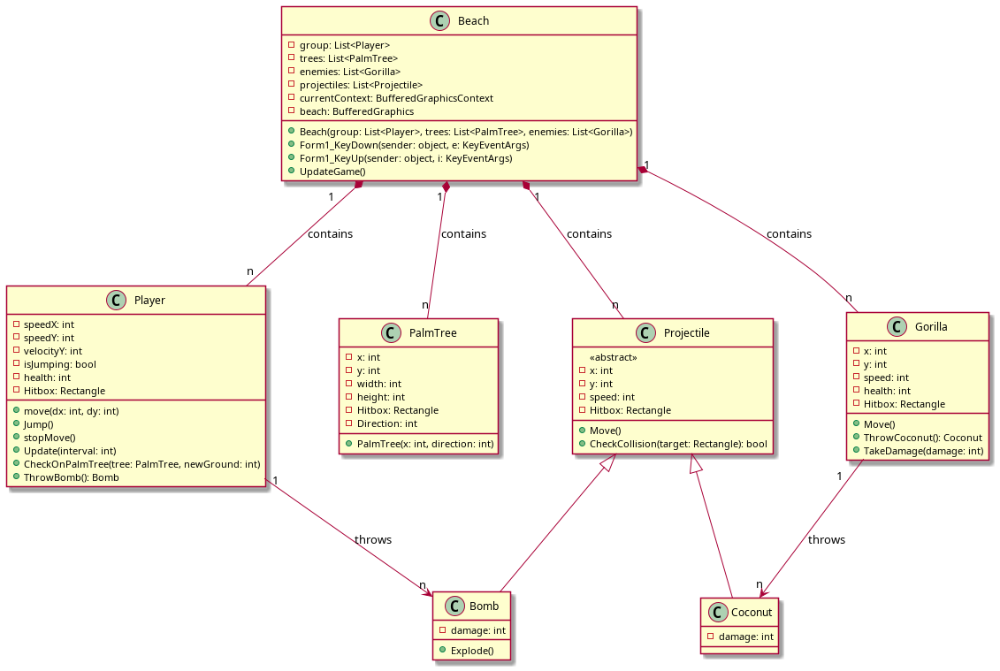

# Rapport Shoothemup

## Introduction

Ce projet consiste à réaliser un jeu vidéo en C# et d'accquérir des compétences en programmation orientée objet. Nous devons faire un jeu vidéo de type shoothemup du thème de notre choix.

J'ai choisi de faire un jeu où le joueur serait un singe qui bougerait de palmier en palmier et qui lancera des bombes sur des gorilles qui sont là pour lui subtiliser les bananes qui sont au pieds des palmiers.
En même temps les gorilles lanceront des noix de coco sur le joueur ce qui lui infligera des dégats sur ses points de vie s'il se fait toucher.

En parralèles nous apprenons à coder en C# en Orienté Objet, ça nous permet de pouvoir 

## Planification

**Semaine 1**
- Définir les fonctionnalités principales (déplacements, sauts, tirs, ennemis, collisions).
- Créer le projet et les classes (`Player`, `PalmTree`, `Gorilla`, etc).
- Faire un schéma rapide du gameplay.

**Semaine 2**
- Implémenter le déplacement horizontal et le saut du singe.
- Gérer la gravité et les collisions avec le sol.
- Limiter les mouvements aux bords de l’écran.

**Semaine 3**
- Ajouter plusieurs palmiers dans la scène.
- Gérer la détection de collision entre le singe et les palmiers.
- Permettre de sauter de l’un à l’autre sans traverser les objets.

**Semaine 4**
- Créer la classe `Gorilla` et son comportement de base.
- Leur permettre de lancer des noix de coco vers le joueur.
- Ajouter la gestion des points de vie du singe.

**Semaine 5**
- Créer une classe `Bomb` (position, trajectoire, dégâts).
- Gérer les collisions entre bombes et gorilles.
- Ajouter un effet d’explosion ou une animation simple.

**Semaine 6**
- Placer les bananes au pied des palmiers.
- Ajouter un score et un système de points de vie.

**Semaine 7**
- Créer une barre de vie.
- Faire en sorte que les gorilles tentent de voler les bananes.

**Semaine 8**
- Corriger les bugs.

## Analyse fonctionnelle

**Objectif du jeu** 
Un Shoot em up est un jeu 2d type "space invader" ou on doit éliminer des ennemis, gagner des points ect... Un jeu d'arcade en somme.

**Comment jouer**
Le joueur controle un petit singe qui se déplace avec les touches A pour aller à gauche et D pour aller à droite il peut également sauter de palmier en palmier en appuyant sur espace. Pour lancer des bombes il faudra appuyer sur la touche enter. La zone rouge et la zone ou le joueur peut se déplacer, sinon quoi, il tombe. Le joueur comme les ennemis ou meme les palmiers ont des points de vie.

**Comportement des ennemis**
Les gorilles sont les ennemis des singes, c'est bien connu, ils n'hésiteront pas à envoyer des noix de coco sur juste au dessus d'eux et et d'aller automatiquement vers les bananes, à moins que vous les éliminiez...

**Les obstacles**
Les palmiers feront office d'obstacle. Ils auront des points de vie et seront donc cassables. Il apparaissent aléatoirement sur la plage au lancement du jeu.

## Conception
Le diagramme UML ci-dessous illustre les classes et comment elles intéragissent entre elles. Malheureusement étant donné que je n'ai pas réussi à finir le code à temps, et bien certaines classes sont présentent là mais pas dans le code.

La classe **Beach** est là classe qui gère la logique du jeu elle a les méthode update et render qui mettent à jour et affichent ce qu'il y a sur la plage

La classe **Player** est la classe du joueur elle a en elle toute la logique de déplacement 

La classe **Palm Tree** elle sert à définir les attribut des palmiers etc elle m'a permis de comprendre comment mettre en place les hitbox.

Le reste des classes sont n'ont pas été implémentée mais c'est à quoi elles auraient ressembler.
## Utilisation de l'IA
J'ai utilisé l'intelligence artificielle pour qu'elle m'explique comment certains concepts fonctionnent comme les hitbox ou les collisions. Ca ne m'a pas forcément été bénéfique étant donné que je n'ai pas réussi à bien implémenter les collisions ce qui m'a retarder sur tout mon projet.